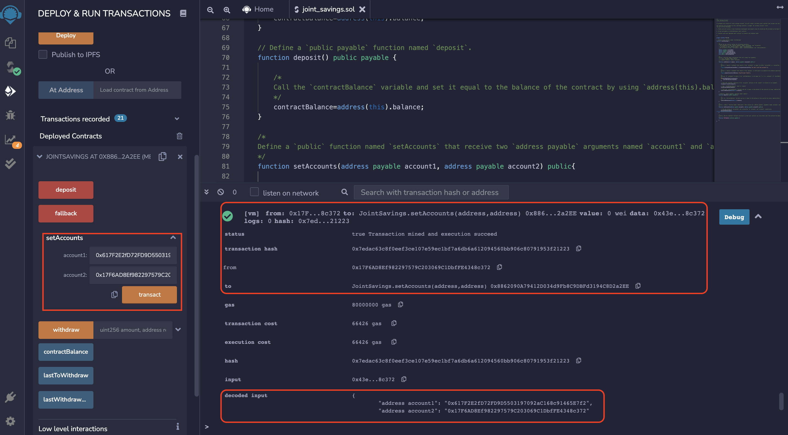

# JointSavings

## Set Two Accounts
Set two accounts as joint account owners.

## Deposit Function

### Transaction 1
Deposit 1 eth to the contract.

### Transaction 2
Deposit 10 eth to the contract.

### Transaction 3
Deposit 5 eth to the contract.

## Withdrwal Function

### Withdrawal 1
Withdraw 5 eth to accountOne.

### Withdrawal 2
Withdraw 10 eth to accountTwo.
